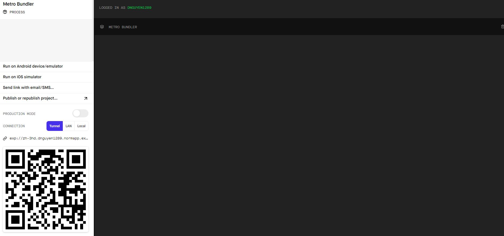

## Norm App

This is the prototype of the MS assistant app that our team built for Code Norm Hackathon 2019. The app attempts to accomplish the mission of "No MS left behind". By creating a connection between each patient, the MS can find someone that understand them, have a big compassion and together encourage one another to live until the end. We provide a small "private/public" social media that allows MS patients find other MS that share similar symptoms. They can also monitor their symptom by enabling the notification function that keeps tracking of their mood, feeling, stress, nutrition and general lifestyle. For option, we also create a personal tab that lets the MS write their own journals, their food logging (diary), and uploading their medication report which will help doctors easily access to it. Importantly, we design various multi-player games that motivate the MS to do exercise virtually. By competiting and playing such a game with other MS, they will have a chance to meet more people and together push each other for improvement. Lastly, we integrate the FitBit Kit to our app so the user's health condition data can be recorded and sent to experts for research.

## Installation Guide and Usage

- On your terminal, type `git clone https://github.com/code-norm/NormApp.git`
- Move to the `NormApp` directory and follow the below installation
- Install `expo` in order launch the app, `npm install -g expo-cli`
- Type `npm install` to download necessary packages
- After that run `expo start`
- Remember to download Expo Client App on your phone
- When you see the below image, scan the code by your phone (IOS or Android is fine) and the app will appear on your phone
  
